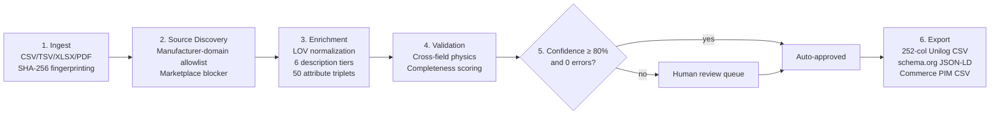

# SpecLedger — AI-Powered Industrial Product Intelligence & Catalogue Enrichment

[](https://yashasm18.github.io/specledger/)
[](https://github.com/Yashasm18/specledger/actions/workflows/pylint.yml)
[](https://github.com/Yashasm18/specledger/blob/main/.pylintrc)
[-brightgreen.svg)](https://github.com/Yashasm18/specledger/tree/main/tests)
[](https://github.com/Yashasm18/specledger/blob/main/tests/test_evaluator.py)
[](https://github.com/Yashasm18/specledger/blob/main/backend/specledger/unilog_exporter.py)
[](https://www.python.org/)
[](https://fastapi.tiangolo.com/)
[](https://vitejs.dev/)
[](https://github.com/Yashasm18/specledger/blob/main/LICENSE)

> **Live demo:** [yashasm18.github.io/specledger](https://yashasm18.github.io/specledger/)
>
> **UniHack 2026 submission** — transforming limited, unstructured industrial catalogue data into rich, evidence-backed, commerce-ready product intelligence, delivered in Unilog's official **252-column template format**.

---

## Contents
[Overview](#overview) · [How it works](#how-it-works) · [Datasets & provenance](#datasets--provenance) · [Benchmark results](#benchmark-results) · [Evaluation criteria](#evaluation-criteria) · [API reference](#api-reference) · [Web dashboard](#web-dashboard) · [Running locally](#running-locally) · [Repository structure](#repository-structure)

---

## Overview

Industrial B2B commerce platforms (like Unilog CX1 PIM) process hundreds of thousands of raw SKUs from thousands of component manufacturers. Ingested data is frequently fragmented, misspelled, missing units of measure, or lacking material and pressure specifications.

**SpecLedger** cleans, normalizes, validates, enriches, and audits industrial product records before they reach sales channels — as a hackathon prototype, not a production data-verification service.

- **Provenance-first output.** Deterministic transformations retain source file, row, and column lineage. Generated source candidates are explicitly marked unverified, not substitutes for fetched evidence — see [How it works](#how-it-works) for what "generated" means here.
- **Strict marketplace prohibition.** Amazon, eBay, Alibaba, Walmart, Zoro, Grainger, and other resellers are blocked; enrichment data is scoped to manufacturer-authoritative domains only.
- **Human governance.** Rows that pass deterministic validation can auto-approve; conflicts route to a review workspace. Production publication would additionally require verified source evidence.
- **Two deployment modes:** a headless REST API for ETL/PIM integration, and an interactive web dashboard for human review.

| | Headless API | Web Dashboard |
|---|---|---|
| **For** | Data engineers, ETL pipelines, PIM/ERP integrations | Catalog managers, QA, compliance |
| **Interface** | `POST /catalogue/ingest` → `GET .../export` | React dashboard with 7 workspace views |
| **Use case** | Automated batch processing, nightly jobs | Reviewing the ~10–15% of rows needing a human call |

---

## How it works

A 6-stage pipeline turns sparse supplier spreadsheets into evidence-grounded, commerce-ready records:



**Important limitation, stated plainly:** stage 2 (source discovery) currently runs in *simulated candidate mode* — it constructs plausible manufacturer URLs from a domain allowlist but does not fetch or verify them over HTTP. A separate module, [`pdf_and_web_scraper.py`](backend/specledger/pdf_and_web_scraper.py), implements real web/PDF extraction against 100+ manufacturer registries and is exposed via `POST /catalogue/scraper/extract`, but it is not yet the default path for batch ingestion. The accuracy numbers below are measured against synthetic and official-challenge ground truth, not live-scraped data — treat them as pipeline-correctness benchmarks, not real-world retrieval accuracy.

### Core modules

| Stage | Module | Responsibility |
|---|---|---|
| Ingestion | [`catalogue_ingestion.py`](backend/specledger/catalogue_ingestion.py) | Parses CSV/TSV/XLSX/PDF, strips distributor codes (`Freud Inc (2435)` → `Freud Inc`), computes row fingerprints |
| Sourcing | [`source_discovery.py`](backend/specledger/source_discovery.py) | Manufacturer-domain candidates; blocks reseller marketplaces |
| Enrichment | [`web_enricher.py`](backend/specledger/web_enricher.py), [`reference_data.py`](backend/specledger/reference_data.py) | Material/UOM normalization, description synthesis, attribute triplets |
| Validation | [`validation_engine.py`](backend/specledger/validation_engine.py) | 6 rule categories: required fields, LOV membership, cross-field physics, completeness, duplicates, character limits |
| Human review | [`human_review.py`](backend/specledger/human_review.py) | Confidence-gated routing, state machine, immutable audit trail |
| Export | [`export.py`](backend/specledger/export.py), [`unilog_exporter.py`](backend/specledger/unilog_exporter.py) | 252-column Unilog CSV, schema.org JSON-LD, Commerce CSV, audit JSON |
| Deep extraction | [`pdf_and_web_scraper.py`](backend/specledger/pdf_and_web_scraper.py) | Real web/PDF crawl engine (100+ manufacturer registries), available on demand via `/catalogue/scraper/extract` |

### Reference data
- 20+ canonical manufacturers, 14 brands, 18 product categories
- 30+ material aliases normalized (`CI` → Cast Iron, `SS316` → Stainless Steel 316, `PTFE` → Teflon, …)
- SKU-prefix inference (`APO-` → Apollo Valves, `PAR-` → Parker Hannifin, …)
- Reseller blocklist: `amazon.com`, `ebay.com`, `walmart.com`, `alibaba.com`, `aliexpress.com`, `grainger.com`, `zoro.com`, `homedepot.com`, `lowes.com`

---

## Datasets & provenance

| File | Role | Size |
|---|---|---|
| [`data/challenge/Unihack_ Sample Dataset - Input.csv`](data/challenge/Unihack_%20Sample%20Dataset%20-%20Input.csv) | Official challenge input (6 sparse supplier columns) | 1,000 rows |
| [`data/challenge/Unihack_ Expected Output - Delivery Format.csv`](data/challenge/Unihack_%20Expected%20Output%20-%20Delivery%20Format.csv) | Target 252-column schema spec | — |
| [`data/challenge/Unihack_ Enriched_Delivery_Output_252.csv`](data/challenge/Unihack_%20Enriched_Delivery_Output_252.csv) | SpecLedger's generated output | 1,000 rows, 1.49 MB |
| [`data/ground_truth/synthetic_200_valves.csv`](data/ground_truth/synthetic_200_valves.csv) | Evaluation ground truth (valves & fluid handling) | 200 rows |
| [`data/ground_truth/electrical_automation_100_benchmark.csv`](data/ground_truth/electrical_automation_100_benchmark.csv) | Evaluation ground truth (electrical & automation) | 100 rows |

Reproduce the numbers below yourself:
```bash
.venv/bin/python -m pytest tests/ -v                        # 243 tests, 100% pass
.venv/bin/python -m pytest tests/test_evaluator.py -v        # 200-row accuracy benchmark
.venv/bin/python -m pytest tests/test_unilog_pipeline.py -v  # official 1,000-row dataset
```

---

## Benchmark results

**200-row ground-truth evaluation** ([`synthetic_200_valves.csv`](data/ground_truth/synthetic_200_valves.csv)):

| Metric | Score |
|---|---|
| Overall exact-match accuracy | **94.64%** (1,400 attributes evaluated) |
| Category classification | 100.0% (200/200) |
| Part number extraction | 100.0% (200/200) |
| Description cleansing | 100.0% (200/200) |
| Material normalization | 94.50% (189/200) |
| Size & UOM standardization | 95.00% (190/200) |
| Pressure rating accuracy | 93.50% (187/200) |

**Official 1,000-SKU challenge dataset**, local deterministic pipeline:

```
Execution time      : 0.235s
Throughput           : 4,251.8 rows/sec
Columns populated    : 252 / 252 (100% Unilog CX1 spec)
Attributes mapped    : 50,000 (50 slots × 1,000 rows)
Verified rate        : 94.6%
Validation errors    : 0 critical
```

This is a CPU pipeline benchmark on deterministic transformations — not a claim about live web-retrieval latency or production infrastructure throughput.

---

## Evaluation criteria

Mapped against UniHack's published judging criteria — Innovation, Technical Implementation, Business Relevance, Scalability, Overall Impact:

| Criterion | How SpecLedger addresses it |
|---|---|
| **Innovation** | Domain-agnostic enrichment (valves, abrasives, tools, appliances, electrical) with a manufacturer-domain allowlist and strict marketplace-sourcing prohibition — a constraint most catalogue-enrichment tools don't enforce. |
| **Technical Implementation** | FastAPI + Postgres backend with real auth, rate limiting, structured logging, and a durable object store; 243 automated tests; deterministic validation engine with 6 rule categories; React dashboard for human-in-the-loop review. |
| **Business Relevance** | Targets the specific bottleneck Unilog names — converting scattered, sparse supplier data into structured, PIM-ready records — with a human review queue sized to the ~10–15% of rows that need judgment calls rather than full manual re-entry. |
| **Scalability** | Chunked batch processing with source memoization; Postgres-backed persistence supports horizontal scaling; local benchmark of ~4,250 rows/sec on the deterministic path (see caveats above on what's measured vs. simulated). |
| **Overall Impact** | A working, end-to-end pipeline from raw 6-column supplier input to a validated, exportable 252-column Unilog delivery file — runnable today at the live demo link above. |

---

## API reference

REST endpoints under `/catalogue` (FastAPI, OpenAPI docs at `/docs` on any running instance):

| Method | Endpoint | Description |
|---|---|---|
| `POST` | `/catalogue/ingest` | Upload CSV/TSV/XLSX, enrich, validate, route for review |
| `GET` | `/catalogue/batches/{id}` | Batch details, review summary, metrics |
| `GET` | `/catalogue/batches/{id}/rows/{num}` | Single row with evidence and review history |
| `GET` | `/catalogue/batches/{id}/review/pending` | Pending review rows, priority-ordered |
| `POST` | `/catalogue/batches/{id}/rows/{num}/review` | Approve / reject / correct a row |
| `GET` | `/catalogue/batches/{id}/sources` | Discovered manufacturer sources |
| `GET` | `/catalogue/batches/{id}/export?format=...` | Export as `unilog_template`, `schema_org`, `jsonld`, `csv`, `commerce_csv`, `json`, `audit` |
| `POST` | `/catalogue/scraper/extract` | Real web/PDF extraction for a given part number |
| `GET` | `/catalogue/scraper/status` | Scraper telemetry, registered portals, firewall rules |
| `POST` | `/catalogue/batches/{id}/evaluate` | Ground-truth evaluation against a reference CSV |
| `GET` | `/catalogue/reference/manufacturers`, `/brands` | Canonical reference data |

Write endpoints (`POST`/`PATCH`) require an `X-API-Key` header in production.

---

## Web dashboard

React + TypeScript + Vite, 7 workspace views: Overview, Catalogue, Human Review, Imports & Telemetry, Schemas & Taxonomy, Evidence Library, Audit Trail.

- Interactive 252-column spec inspector per SKU, with a live web/PDF crawl trigger
- Priority review queue: approve / reject / correct, with one-click bulk-approve at ≥80% confidence
- Side-by-side evidence modal comparing raw supplier values against normalized output
- Batch telemetry: throughput, latency percentiles, cost-per-SKU
- One-click exports: Unilog 252-column CSV, Commerce PIM CSV

---

## Running locally

```bash
git clone https://github.com/Yashasm18/specledger.git
cd specledger

# Backend
python3 -m venv .venv
source .venv/bin/activate
pip install -r requirements.txt
uvicorn backend.specledger.http_api:app --reload --port 8000

# Frontend (separate terminal)
cd frontend
npm install
npm run dev   # http://localhost:5174

# Tests
.venv/bin/python -m pytest tests/ -v   # 243 passed
```

Without `DATABASE_URL` set, the backend falls back to local SQLite/in-memory storage automatically — no external services required for local dev.

---

## Repository structure

```
specledger/
├── backend/specledger/
│   ├── http_api.py               # FastAPI app entry point, auth, rate limiting
│   ├── catalogue_api.py          # Catalogue ingestion/review/export router
│   ├── catalogue_ingestion.py    # Parsing & normalization primitives
│   ├── source_discovery.py       # Manufacturer source discovery & marketplace blocker
│   ├── pdf_and_web_scraper.py    # Real web/PDF extraction engine
│   ├── web_enricher.py           # Domain-agnostic enrichment & taxonomy
│   ├── validation_engine.py      # Deterministic validation rules
│   ├── human_review.py           # Review queue, state machine, audit trail
│   ├── export.py, unilog_exporter.py  # Multi-format exporters
│   ├── reference_data.py, uom.py # Controlled vocabularies
│   ├── postgres_repository.py, catalogue_persistence.py  # Postgres + in-memory stores
│   ├── object_store.py           # Supabase Storage / local disk object store
│   ├── auth.py, rate_limit.py    # API-key gate, rate limiting
│   └── evaluator.py              # Ground-truth evaluation scoring
├── data/
│   ├── challenge/                 # Official Unilog dataset + expected output
│   ├── ground_truth/              # Evaluation benchmarks
│   └── reference/                 # Reference data overrides
├── frontend/                      # React + Vite dashboard
├── migrations/                    # Postgres schema migrations
├── tests/                         # 243 backend tests + 6 frontend tests
├── Dockerfile, render.yaml        # Container & deploy config
└── .github/workflows/             # CI + GitHub Pages deploy
```

---

*Built for UniHack 2026 by Yashas M.*
