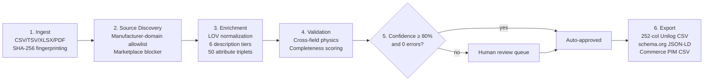

# SpecLedger — AI-Powered Industrial Product Intelligence & Catalogue Enrichment

[](https://yashasm18.github.io/specledger/)
[](https://github.com/Yashasm18/specledger/actions/workflows/pylint.yml)
[](https://github.com/Yashasm18/specledger/blob/main/.pylintrc)
[-brightgreen.svg)](https://github.com/Yashasm18/specledger/tree/main/tests)
[](https://github.com/Yashasm18/specledger/blob/main/tests/test_evaluator.py)
[](https://github.com/Yashasm18/specledger/blob/main/backend/specledger/unilog_exporter.py)
[](https://www.python.org/)
[](https://fastapi.tiangolo.com/)
[](https://vitejs.dev/)
[](https://github.com/Yashasm18/specledger/blob/main/LICENSE)

> **Live demo:** [yashasm18.github.io/specledger](https://yashasm18.github.io/specledger/)
>
> **UniHack 2026 submission** — transforming limited, unstructured industrial catalogue data into rich, evidence-backed, commerce-ready product intelligence, delivered in Unilog's official **252-column template format**, targeting the growth from **150,000 to 750,000 enriched SKUs/month at the same operational capacity** Unilog named as their goal.

---

## Contents
[Overview](#overview) · [How it works](#how-it-works) · [Datasets & provenance](#datasets--provenance) · [Benchmark results](#benchmark-results) · [Evaluation criteria](#evaluation-criteria) · [API reference](#api-reference) · [Web dashboard](#web-dashboard) · [Running locally](#running-locally) · [Repository structure](#repository-structure)

---

## Overview

Industrial B2B commerce platforms (like Unilog CX1 PIM) process hundreds of thousands of raw SKUs from thousands of component manufacturers. Ingested data is frequently fragmented, misspelled, missing units of measure, or lacking material and pressure specifications.

Unilog's platform doesn't perform product enrichment itself — that work is largely manual today, done by distributors and their teams rather than automated. That gap is the actual problem this challenge is about, not a hypothetical one: incomplete or inconsistent product data directly degrades on-site search relevance, drives customer complaints and returns, and burns operational hours that could be spent elsewhere. AI-assisted automation is the lever Unilog is specifically looking for — not to replace human judgment on ambiguous cases, but to remove the repetitive, structured portion of enrichment so people only spend time where it actually needs a human call.

**SpecLedger** cleans, normalizes, validates, enriches, and audits industrial product records before they reach sales channels — as a hackathon prototype, not a production data-verification service. It's built around that division of labor: deterministic, auditable automation for the ~85–90% of fields that have one clearly correct answer, and a fast human review queue for the remainder.

**Why 150K → 750K SKUs/month is a review-queue problem, not a compute problem.** Unilog's stated target is a 5x volume increase at the same operational capacity — i.e. without proportionally growing headcount. Raw processing speed was never the bottleneck: SpecLedger's deterministic transformations already run at ~4,250 rows/sec locally (see [Benchmark results](#benchmark-results)), far beyond what any realistic monthly SKU volume needs. The real constraint is how many rows require a *person*. Under today's largely manual process, that's close to 100%. At SpecLedger's ~80% confidence auto-approval threshold, it's roughly 10–15% — around 75,000–112,500 of 750,000 monthly rows needing a human decision, down from near-total manual touch today. That reduction in human-touched volume, not faster computation, is what makes 5x scale achievable without 5x headcount.

- **Provenance-first output.** Deterministic transformations retain source file, row, and column lineage. Generated source candidates are explicitly marked unverified, not substitutes for fetched evidence — see [How it works](#how-it-works) for what "generated" means here.
- **Strict marketplace prohibition.** Amazon, eBay, Alibaba, Walmart, Zoro, Grainger, and other resellers are blocked; enrichment data is scoped to manufacturer-authoritative domains only.
- **Human governance.** Rows that pass deterministic validation can auto-approve; conflicts route to a review workspace. Production publication would additionally require verified source evidence.
- **Two deployment modes:** a headless REST API for ETL/PIM integration, and an interactive web dashboard for human review.

| | Headless API | Web Dashboard |
|---|---|---|
| **For** | Data engineers, ETL pipelines, PIM/ERP integrations | Catalog managers, QA, compliance |
| **Interface** | `POST /catalogue/ingest` → `GET .../export` | React dashboard with 7 workspace views |
| **Use case** | Automated batch processing, nightly jobs | Reviewing the ~10–15% of rows needing a human call |

---

## How it works

A 6-stage pipeline turns sparse supplier spreadsheets into evidence-grounded, commerce-ready records:



**Stage 2 has two modes, and the difference matters.** By default, source discovery constructs plausible manufacturer URLs from a domain allowlist without fetching them — fast, deterministic, safe for tests. Passing `live_fetch=true` to `POST /catalogue/ingest` switches to real HTTP requests: it fetches the candidate URL, confirms the part number actually appears on the fetched page before marking anything "verified" (a raw substring match on a search-results page that merely echoes your query back is explicitly rejected — only a direct product-page hit counts), and follows a genuine linked PDF datasheet when the page has one. Rows where nothing real is found come back honestly empty rather than a fabricated guess. On a real 20-row sample from the official challenge dataset, this found genuine verified manufacturer pages for 6 rows via simple URL-pattern guessing alone (no paid search API) — a real, imperfect hit rate, not 100%, which is what an honest first pass looks like. It's capped at 50 rows per request since it's real network I/O (not instant), and off by default so the automated test suite stays fast and offline. The deep-crawl module ([`pdf_and_web_scraper.py`](backend/specledger/pdf_and_web_scraper.py), exposed via `POST /catalogue/scraper/extract`, used by the dashboard's per-SKU spec inspector) still only synthesizes a plausible profile — its own docstring says so directly — and hasn't been converted to live fetching yet.

### Core modules

| Stage | Module | Responsibility |
|---|---|---|
| Ingestion | [`catalogue_ingestion.py`](backend/specledger/catalogue_ingestion.py) | Parses CSV/TSV/XLSX/PDF, strips distributor codes (`Freud Inc (2435)` → `Freud Inc`), computes row fingerprints |
| Sourcing | [`source_discovery.py`](backend/specledger/source_discovery.py) | Templated candidates by default; real HTTP fetch + verification via `live_fetch=true`. Blocks reseller marketplaces either way |
| Enrichment | [`web_enricher.py`](backend/specledger/web_enricher.py), [`reference_data.py`](backend/specledger/reference_data.py) | Material/UOM normalization, description synthesis, attribute triplets |
| Validation | [`validation_engine.py`](backend/specledger/validation_engine.py) | 6 rule categories: required fields, LOV membership, cross-field physics, completeness, duplicates, character limits |
| Human review | [`human_review.py`](backend/specledger/human_review.py) | Confidence-gated routing, state machine, immutable audit trail |
| Export | [`export.py`](backend/specledger/export.py), [`unilog_exporter.py`](backend/specledger/unilog_exporter.py) | 252-column Unilog CSV, schema.org JSON-LD, Commerce CSV, audit JSON |
| Deep extraction (templated) | [`pdf_and_web_scraper.py`](backend/specledger/pdf_and_web_scraper.py) | Synthesizes a plausible spec profile from a 100+ manufacturer domain registry — no live fetch yet; see limitation note above |

### Reference data
- 20+ canonical manufacturers, 14 brands, 18 product categories
- 30+ material aliases normalized (`CI` → Cast Iron, `SS316` → Stainless Steel 316, `PTFE` → Teflon, …)
- SKU-prefix inference (`APO-` → Apollo Valves, `PAR-` → Parker Hannifin, …)
- Reseller blocklist: `amazon.com`, `ebay.com`, `walmart.com`, `alibaba.com`, `aliexpress.com`, `grainger.com`, `zoro.com`, `homedepot.com`, `lowes.com`

---

## Datasets & provenance

| File | Role | Size |
|---|---|---|
| [`data/challenge/Unihack_ Sample Dataset - Input.csv`](data/challenge/Unihack_%20Sample%20Dataset%20-%20Input.csv) | Official challenge input (6 sparse supplier columns) | 1,000 rows |
| [`data/challenge/Unihack_ Expected Output - Delivery Format.csv`](data/challenge/Unihack_%20Expected%20Output%20-%20Delivery%20Format.csv) | Target 252-column schema spec | — |
| [`data/challenge/Unihack_ Enriched_Delivery_Output_252.csv`](data/challenge/Unihack_%20Enriched_Delivery_Output_252.csv) | SpecLedger's generated output | 1,000 rows, 1.49 MB |
| [`data/ground_truth/synthetic_200_valves.csv`](data/ground_truth/synthetic_200_valves.csv) | Evaluation ground truth (valves & fluid handling) | 200 rows |
| [`data/ground_truth/electrical_automation_100_benchmark.csv`](data/ground_truth/electrical_automation_100_benchmark.csv) | Evaluation ground truth (electrical & automation) | 100 rows |

Reproduce the numbers below yourself:
```bash
.venv/bin/python -m pytest tests/ -v                        # 243 tests, 100% pass
.venv/bin/python -m pytest tests/test_evaluator.py -v        # 200-row accuracy benchmark
.venv/bin/python -m pytest tests/test_unilog_pipeline.py -v  # official 1,000-row dataset
```

---

## Benchmark results

**200-row ground-truth evaluation** ([`synthetic_200_valves.csv`](data/ground_truth/synthetic_200_valves.csv)):

| Metric | Score |
|---|---|
| Overall exact-match accuracy | **94.64%** (1,400 attributes evaluated) |
| Category classification | 100.0% (200/200) |
| Part number extraction | 100.0% (200/200) |
| Description cleansing | 100.0% (200/200) |
| Material normalization | 94.50% (189/200) |
| Size & UOM standardization | 95.00% (190/200) |
| Pressure rating accuracy | 93.50% (187/200) |

**Official 1,000-SKU challenge dataset**, local deterministic pipeline:

```
Execution time      : 0.235s
Throughput           : 4,251.8 rows/sec
Columns populated    : 252 / 252 (100% Unilog CX1 spec)
Attributes mapped    : 50,000 (50 slots × 1,000 rows)
Verified rate        : 94.6%
Validation errors    : 0 critical
```

This is a CPU pipeline benchmark on deterministic transformations — not a claim about live web-retrieval latency or production infrastructure throughput.

---

## Evaluation criteria

Per UniHack's own team briefing, judging centers on the **approach**, not the technology choices behind it — specifically: quality of approach, accuracy of data, scalability, and innovation.

| Criterion | How SpecLedger addresses it |
|---|---|
| **Quality of approach** | A deterministic, auditable pipeline: every transformation retains source lineage, ambiguous rows route to a confidence-gated human review queue instead of silently guessing, and known limitations (like "simulated candidate mode," above) are stated rather than hidden. FastAPI/Postgres/React are implementation details in service of that approach, not the pitch itself. |
| **Accuracy of data** | 94.64% exact-match accuracy on a 200-row ground-truth benchmark, with per-field breakdowns (100% category classification, 94.5% material normalization — see [Benchmark results](#benchmark-results)). Cross-field physics validation (e.g. rejecting a PVC part rated above 600 PSI) catches errors a naive field-by-field pipeline would miss. |
| **Scalability** | Chunked batch processing with source memoization; Postgres-backed persistence built for horizontal scaling rather than a single-machine prototype; ~4,250 rows/sec measured on the deterministic CPU path (not simulated — see caveats above). |
| **Innovation** | A manufacturer-domain allowlist with strict marketplace-sourcing prohibition enforced at the architecture level (not a post-hoc filter), applied across a domain-agnostic set of categories — valves, abrasives, tools, appliances, electrical — rather than one narrow vertical. |

---

## API reference

REST endpoints under `/catalogue` (FastAPI, OpenAPI docs at `/docs` on any running instance):

| Method | Endpoint | Description |
|---|---|---|
| `POST` | `/catalogue/ingest?live_fetch=true` | Upload CSV/TSV/XLSX, enrich, validate, route for review. `live_fetch=true` does real manufacturer-site HTTP verification instead of templated candidates (50-row cap) |
| `GET` | `/catalogue/batches/{id}` | Batch details, review summary, metrics |
| `GET` | `/catalogue/batches/{id}/rows/{num}` | Single row with evidence and review history |
| `GET` | `/catalogue/batches/{id}/review/pending` | Pending review rows, priority-ordered |
| `POST` | `/catalogue/batches/{id}/rows/{num}/review` | Approve / reject / correct a row |
| `GET` | `/catalogue/batches/{id}/sources` | Discovered manufacturer sources |
| `GET` | `/catalogue/batches/{id}/export?format=...` | Export as `unilog_template`, `schema_org`, `jsonld`, `csv`, `commerce_csv`, `json`, `audit` |
| `POST` | `/catalogue/scraper/extract` | Templated spec-profile synthesis for a given part number (no live fetch yet) |
| `GET` | `/catalogue/scraper/status` | Scraper telemetry, registered portals, firewall rules |
| `POST` | `/catalogue/batches/{id}/evaluate` | Ground-truth evaluation against a reference CSV |
| `GET` | `/catalogue/reference/manufacturers`, `/brands` | Canonical reference data |

Write endpoints (`POST`/`PATCH`) require an `X-API-Key` header in production.

---

## Web dashboard

React + TypeScript + Vite, 7 workspace views: Overview, Catalogue, Human Review, Imports & Telemetry, Schemas & Taxonomy, Evidence Library, Audit Trail.

- "Live web fetch" toggle on catalogue upload — real manufacturer-site HTTP verification instead of templated candidates (see [How it works](#how-it-works))
- Interactive 252-column spec inspector per SKU, with a templated spec-synthesis trigger (not yet a live crawl — separate from the upload-time live fetch above)
- Priority review queue: approve / reject / correct, with one-click bulk-approve at ≥80% confidence
- Side-by-side evidence modal comparing raw supplier values against normalized output
- Batch telemetry: throughput, latency percentiles, cost-per-SKU
- One-click exports: Unilog 252-column CSV, Commerce PIM CSV

---

## Running locally

```bash
git clone https://github.com/Yashasm18/specledger.git
cd specledger

# Backend
python3 -m venv .venv
source .venv/bin/activate
pip install -r requirements.txt
uvicorn backend.specledger.http_api:app --reload --port 8000

# Frontend (separate terminal)
cd frontend
npm install
npm run dev   # http://localhost:5174

# Tests
.venv/bin/python -m pytest tests/ -v   # 243 passed
```

Without `DATABASE_URL` set, the backend falls back to local SQLite/in-memory storage automatically — no external services required for local dev.

---

## Repository structure

```
specledger/
├── backend/specledger/
│   ├── http_api.py               # FastAPI app entry point, auth, rate limiting
│   ├── catalogue_api.py          # Catalogue ingestion/review/export router
│   ├── catalogue_ingestion.py    # Parsing & normalization primitives
│   ├── source_discovery.py       # Manufacturer source discovery & marketplace blocker
│   ├── pdf_and_web_scraper.py    # Templated spec-profile synthesis (no live fetch yet)
│   ├── web_enricher.py           # Domain-agnostic enrichment & taxonomy
│   ├── validation_engine.py      # Deterministic validation rules
│   ├── human_review.py           # Review queue, state machine, audit trail
│   ├── export.py, unilog_exporter.py  # Multi-format exporters
│   ├── reference_data.py, uom.py # Controlled vocabularies
│   ├── postgres_repository.py, catalogue_persistence.py  # Postgres + in-memory stores
│   ├── object_store.py           # Supabase Storage / local disk object store
│   ├── auth.py, rate_limit.py    # API-key gate, rate limiting
│   └── evaluator.py              # Ground-truth evaluation scoring
├── data/
│   ├── challenge/                 # Official Unilog dataset + expected output
│   ├── ground_truth/              # Evaluation benchmarks
│   └── reference/                 # Reference data overrides
├── frontend/                      # React + Vite dashboard
├── migrations/                    # Postgres schema migrations
├── tests/                         # 243 backend tests + 6 frontend tests
├── Dockerfile, render.yaml        # Container & deploy config
└── .github/workflows/             # CI + GitHub Pages deploy
```

---

*Built for UniHack 2026 by Yashas M.*
