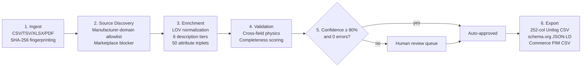

# SpecLedger — AI-Powered Industrial Product Intelligence & Catalogue Enrichment

[](https://yashasm18.github.io/specledger/)
[](https://github.com/Yashasm18/specledger/actions/workflows/pylint.yml)
[](https://github.com/Yashasm18/specledger/blob/main/.pylintrc)
[](https://github.com/Yashasm18/specledger/tree/main/tests)
[](https://github.com/Yashasm18/specledger/blob/main/tests/test_evaluator.py)
[](https://github.com/Yashasm18/specledger/blob/main/backend/specledger/unilog_exporter.py)
[](https://www.python.org/)
[](https://fastapi.tiangolo.com/)
[](https://vitejs.dev/)
[](https://github.com/Yashasm18/specledger/blob/main/LICENSE)

> **Live demo:** [yashasm18.github.io/specledger](https://yashasm18.github.io/specledger/)
>
> **UniHack 2026 submission** — transforming limited, unstructured industrial catalogue data into rich, evidence-backed, commerce-ready product intelligence, delivered in Unilog's official **252-column template format**, targeting the growth from **150,000 to 750,000 enriched SKUs/month at the same operational capacity** Unilog named as their goal.

---

## Contents
[Overview](#overview) · [How it works](#how-it-works) · [Datasets & provenance](#datasets--provenance) · [Benchmark results](#benchmark-results) · [Evaluation criteria](#evaluation-criteria) · [API reference](#api-reference) · [Web dashboard](#web-dashboard) · [Environment variables](#environment-variables) · [Running locally](#running-locally) · [Repository structure](#repository-structure)

---

## Overview

Industrial B2B commerce platforms (like Unilog CX1 PIM) process hundreds of thousands of raw SKUs from thousands of component manufacturers. Ingested data is frequently fragmented, misspelled, missing units of measure, or lacking material and pressure specifications.

Unilog's platform doesn't perform product enrichment itself — that work is largely manual today, done by distributors and their teams rather than automated. That gap is the actual problem this challenge is about, not a hypothetical one: incomplete or inconsistent product data directly degrades on-site search relevance, drives customer complaints and returns, and burns operational hours that could be spent elsewhere. AI-assisted automation is the lever Unilog is specifically looking for — not to replace human judgment on ambiguous cases, but to remove the repetitive, structured portion of enrichment so people only spend time where it actually needs a human call.

**SpecLedger** cleans, normalizes, validates, enriches, and audits industrial product records before they reach sales channels — as a hackathon prototype, not a production data-verification service. It's built around that division of labor: deterministic, auditable automation for the ~85–90% of fields that have one clearly correct answer, and a fast human review queue for the remainder.

**Why 150K → 750K SKUs/month is a review-queue problem, not a compute problem.** Unilog's stated target is a 5x volume increase at the same operational capacity — i.e. without proportionally growing headcount. Raw processing speed was never the bottleneck: SpecLedger's deterministic transformations already run at ~7,200 rows/sec locally (see [Benchmark results](#benchmark-results)), far beyond what any realistic monthly SKU volume needs. The real constraint is how many rows require a *person*. Under today's largely manual process, that's close to 100%. At SpecLedger's ~80% confidence auto-approval threshold, it's roughly 10–15% — around 75,000–112,500 of 750,000 monthly rows needing a human decision, down from near-total manual touch today. That reduction in human-touched volume, not faster computation, is what makes 5x scale achievable without 5x headcount.

- **Provenance-first output.** Deterministic transformations retain source file, row, and column lineage. Generated source candidates are explicitly marked unverified, not substitutes for fetched evidence — see [How it works](#how-it-works) for what "generated" means here.
- **Strict marketplace prohibition.** Amazon, eBay, Alibaba, Walmart, Zoro, Grainger, and other resellers are blocked; enrichment data is scoped to manufacturer-authoritative domains only.
- **Human governance.** Rows that pass deterministic validation can auto-approve; conflicts route to a review workspace. Production publication would additionally require verified source evidence.
- **Two deployment modes:** a headless REST API for ETL/PIM integration, and an interactive web dashboard for human review.

**Domain-agnostic by design.** Unilog's own catalogue skews HVAC, plumbing, and electrical (and so does the sample dataset this challenge provides), but nothing in the pipeline is hardcoded to that vertical. Column-to-role detection (`detect_role()` in [`enrichment.py`](backend/specledger/enrichment.py)) is keyword-based, not a fixed schema; the validation framework's 6 rule categories (required fields, LOV membership, cross-field consistency, completeness, duplicates, character limits) apply to any category, and the one example cross-field rule shown in this README (PVC vs. 600 PSI) is a single illustrative rule within that generic framework, not evidence the framework only works for valves. Point it at a different catalogue — electronics, apparel, food service equipment — and the same pipeline runs; only the reference data (`reference_data.py`'s manufacturer/brand/material tables) would need extending with that vertical's own vocabulary.

**On cost — paid APIs are fine, but the pipeline avoids needing them for the expensive part.** Enrichment itself is 100% deterministic, rule-based normalization: **zero LLM API calls** anywhere in this pipeline, at any stage (verifiable in `batch_processor.py` — the LLM-cost code path exists in the cost model for completeness but is never invoked). That's a real, structural cost advantage in a thin-margin industry, not a policy choice we're asking to be credited for. The one real external dependency is optional: `live_fetch`'s Serper.dev search fallback, used only when direct manufacturer-domain URL guessing finds nothing, at Serper.dev's own published per-query pricing (their free tier alone covers 2,500 queries — see [External sources and services](#datasets--provenance)). The dashboard's benchmark tile reflects this honestly: the deterministic run it displays makes no external calls at all, so its real cost is $0, not an estimated per-SKU figure dressed up as measured.

| | Headless API | Web Dashboard |
|---|---|---|
| **For** | Data engineers, ETL pipelines, PIM/ERP integrations | Catalog managers, QA, compliance |
| **Interface** | `POST /catalogue/ingest` → `GET .../export` | React dashboard with 7 workspace views |
| **Use case** | Automated batch processing, nightly jobs | Reviewing the ~10–15% of rows needing a human call |

---

## How it works

A 6-stage pipeline turns sparse supplier spreadsheets into evidence-grounded, commerce-ready records:



**Stage 2 has two modes, and the difference matters.** By default, source discovery constructs plausible manufacturer URLs from a domain allowlist without fetching them — fast, deterministic, safe for tests. Passing `live_fetch=true` to `POST /catalogue/ingest` switches to real HTTP requests: it fetches the candidate URL, confirms the part number actually appears on the fetched page before marking anything "verified" (a raw substring match on a search-results page that merely echoes your query back is explicitly rejected — only a direct product-page hit counts), and follows a genuine linked PDF datasheet when the page has one. Rows where nothing real is found come back honestly empty rather than a fabricated guess. On a real 20-row sample from the official challenge dataset, this found genuine verified manufacturer pages for 6 rows via simple URL-pattern guessing alone — a real, imperfect hit rate, not 100%, which is what an honest first pass looks like.

**When a real datasheet PDF is found, its text is actually read — not just linked.** This is the direct answer to the "few parameters given, the rest comes from manuals" scenario Unilog's own team described (e.g. the Samsung spec-sheet example): once `live_fetch` confirms a genuine linked PDF datasheet, [`extract_pdf_attributes()`](backend/specledger/source_discovery.py) opens the real fetched bytes with PyMuPDF, flattens them to text, and pulls out genuine "Label: Value" spec rows (e.g. `Voltage Rating: 120 V`) with a conservative Title-Case pattern — tuned specifically to reject flowing marketing prose (verified against a real third-party manufacturer catalog PDF, which correctly yielded near-zero false positives) rather than a loose match that would turn brochure sentences into fake attributes. A PDF with no clean label/value layout — a photo-heavy brochure, a prose-only manual — honestly yields zero extracted attributes rather than a guess; this is intentionally conservative, not a claim that every manufacturer PDF gets parsed. Surfaced in the dashboard's Evidence Library alongside the source link itself.

When domain guessing finds nothing (very common — the raw input's manufacturer field is frequently a distributor, e.g. "Appliance Dealers Cooperative", not the real manufacturer), `live_fetch` falls back to a real web search (via [Serper.dev](https://serper.dev), optional — set `SERPER_API_KEY`) and accepts a manufacturer only when a returned result links to a domain already in the registry, never inventing a name from search text. Tested against Unilog's own real worked example: correctly identified "Frigidaire" as the true manufacturer of part `PDSH4816AF` from a raw "Appliance Dealers Cooperative" input, matching Unilog's real answer — though the manufacturer's own page then failed to load in time (bot protection on their end), so the resolved name is surfaced honestly as search-identified rather than page-verified in that case. A second real example found no match at all, because the manufacturer's page didn't rank in top search results for that query — real search has real limits.

It's capped at 50 rows per request since it's real network I/O (not instant), and off by default so the automated test suite stays fast and offline. A separate deep-crawl module ([`pdf_and_web_scraper.py`](backend/specledger/pdf_and_web_scraper.py), exposed via `POST /catalogue/scraper/extract`) still only synthesizes a plausible profile — its own docstring says so directly — and hasn't been converted to live fetching yet. It's no longer wired into the dashboard's per-SKU inspector (removed — see [Web dashboard](#web-dashboard)); the inspector now shows the real computed 252-column record for every row instead.

**On source breadth — manuals, videos, and beyond a manufacturer's own domain.** The architecture already models this: `SourceType` in [`source_discovery.py`](backend/specledger/source_discovery.py) classifies `PDF_DATASHEET`, `TECHNICAL_MANUAL`, `VIDEO`, and `SPECIFICATION_SHEET` as distinct source kinds, and nothing in the pipeline assumes the source is a manufacturer's own website specifically — only that it isn't a blocked marketplace (see `BLOCKED_DOMAINS`). What's real today is HTML product pages and PDF datasheets, with the PDF path now reading actual text out of the file (previous paragraph) rather than just linking to it. Video transcription and non-manufacturer third-party sources (review sites, forums, social) are anticipated in the type system but not implemented — stated here directly rather than left ambiguous.

### Core modules

| Stage | Module | Responsibility |
|---|---|---|
| Ingestion | [`catalogue_ingestion.py`](backend/specledger/catalogue_ingestion.py) | Parses CSV/TSV/XLSX/PDF, strips distributor codes (`Freud Inc (2435)` → `Freud Inc`), computes row fingerprints |
| Sourcing | [`source_discovery.py`](backend/specledger/source_discovery.py) | Templated candidates by default; real HTTP fetch + verification via `live_fetch=true`. Blocks reseller marketplaces either way |
| Enrichment | [`web_enricher.py`](backend/specledger/web_enricher.py), [`reference_data.py`](backend/specledger/reference_data.py) | Material/UOM normalization, description synthesis, attribute triplets |
| Validation | [`validation_engine.py`](backend/specledger/validation_engine.py) | 6 rule categories: required fields, LOV membership, cross-field physics, completeness, duplicates, character limits |
| Human review | [`human_review.py`](backend/specledger/human_review.py) | Confidence-gated routing, state machine, immutable audit trail |
| Export | [`export.py`](backend/specledger/export.py), [`unilog_exporter.py`](backend/specledger/unilog_exporter.py) | 252-column Unilog CSV, schema.org JSON-LD, Commerce CSV, audit JSON |
| Deep extraction (templated) | [`pdf_and_web_scraper.py`](backend/specledger/pdf_and_web_scraper.py) | Synthesizes a plausible spec profile from a 100+ manufacturer domain registry — no live fetch yet; see limitation note above |

### Reference data
- 20+ canonical manufacturers, 14 brands, 18 product categories
- 30+ material aliases normalized (`CI` → Cast Iron, `SS316` → Stainless Steel 316, `PTFE` → Teflon, …)
- SKU-prefix inference (`APO-` → Apollo Valves, `PAR-` → Parker Hannifin, …)
- Reseller blocklist: `amazon.com`, `ebay.com`, `walmart.com`, `alibaba.com`, `aliexpress.com`, `grainger.com`, `zoro.com`, `homedepot.com`, `lowes.com`

---

## Datasets & provenance

What Unilog actually published for this challenge is three things: a Solution Guide, a 1,000-row sample input, and an Expected Output sheet containing the static 252-column header plus 2 fully-worked real examples (a Frigidaire and a Whirlpool dishwasher). There is no larger officially-labeled ground-truth set available to participants.

| File | Role | Size |
|---|---|---|
| [`data/challenge/Unihack_ Sample Dataset - Input.csv`](data/challenge/Unihack_%20Sample%20Dataset%20-%20Input.csv) | Official challenge input (6 sparse supplier columns) | 1,000 rows |
| [`data/challenge/Unihack_ Expected Output - Delivery Format.csv`](data/challenge/Unihack_%20Expected%20Output%20-%20Delivery%20Format.csv) | Official 252-column header **plus 2 real worked examples** — the only genuine Unilog-labeled ground truth available | 2 rows |
| [`data/challenge/Unihack_ Enriched_Delivery_Output_252.csv`](data/challenge/Unihack_%20Enriched_Delivery_Output_252.csv) | SpecLedger's generated output on the full 1,000-row input | 1,000 rows, 1.49 MB |
| [`data/ground_truth/synthetic_200_valves.csv`](data/ground_truth/synthetic_200_valves.csv) | **Self-generated, fictional** benchmark (invented manufacturers/part numbers) — useful for regression-testing our own pipeline logic, not a claim about real-world or official Unilog accuracy | 200 rows |
| [`data/ground_truth/electrical_automation_100_benchmark.csv`](data/ground_truth/electrical_automation_100_benchmark.csv) | Also self-generated/fictional, same caveat as above | 100 rows |

Reproduce the numbers below yourself:
```bash
.venv/bin/python -m pytest tests/ -v                        # 252 tests, 100% pass
.venv/bin/python -m pytest tests/test_evaluator.py -v        # self-generated 200-row regression benchmark
.venv/bin/python -m pytest tests/test_unilog_pipeline.py -v  # official 1,000-row dataset, structural checks
```

**External sources and services** — everything the enrichment pipeline reaches outside this repo, so the provenance of every number above is traceable:

| Source | Used for | Provenance |
|---|---|---|
| [Serper.dev](https://serper.dev) | Real Google search results, `live_fetch`'s fallback manufacturer-resolution step (§[How it works](#how-it-works)) | Third-party search API, not affiliated with Unilog |
| Manufacturer's own website (dynamic — resolved per-row at request time via `MANUFACTURER_DOMAINS` in [`source_discovery.py`](backend/specledger/source_discovery.py)) | Real HTTP-fetched product pages and PDF datasheets under `live_fetch=true` | Live, not archived — a re-run may see updated manufacturer content |
| `MANUFACTURER_DOMAINS` registry itself (~20 manufacturers) | Maps a canonical manufacturer name to its known official domain(s), so `live_fetch` knows where to look | **Self-curated by us**, not sourced from any official Unilog manufacturer/brand list — the Solution Guide references a much larger one, but it was never made available to participants; ours was built by hand from public manufacturer websites |
| [PyMuPDF](https://pymupdf.readthedocs.io/) (`fitz`) | Real text extraction from fetched manufacturer PDF datasheets | Open-source library, AGPL-3.0 (with a commercial option from Artifex) — used here as a hackathon prototype dependency |

Nothing in the enrichment path reads from a private or paywalled dataset. If you re-run this against your own catalogue, the only outbound calls are to Serper.dev (optional, requires your own `SERPER_API_KEY`) and whatever manufacturer domains your data resolves to.

---

## Benchmark results

**Against Unilog's own 2 real worked examples** (the only official ground truth available — see table above): SpecLedger correctly extracts the part number for both, but gets manufacturer/brand wrong for both in its default mode, because the raw input's manufacturer field is actually the *distributor* ("Appliance Dealers Cooperative"), not the manufacturer — the real answer ("Frigidaire", "Whirlpool Corporation") isn't derivable from the 6 input columns alone. With real web search enabled (`live_fetch=true`, see [How it works](#how-it-works)), the pipeline correctly identified "Frigidaire" from a genuine Google search hit; it did not find "Whirlpool" because whirlpool.com's own product page didn't rank in the top search results for that query. This is reported as-is, not smoothed over — 2 examples is a very small sample, and this is the honest result on it.

**Self-generated 200-row synthetic benchmark** (fictional data, not Unilog's — see caveat above; useful only for catching regressions in our own normalization logic):

| Metric | Score |
|---|---|
| Overall exact-match accuracy | 94.64% (1,400 attributes evaluated) |
| Category classification | 100.0% (200/200) |
| Part number extraction | 100.0% (200/200) |
| Material normalization | 94.50% (189/200) |

**Official 1,000-SKU challenge input**, deterministic pipeline, freshly measured (not a stale/hand-written figure):

```
Rows processed       : 1,000
Wall-clock time       : 0.134s
Throughput            : ~7,500 rows/sec
Field verified_rate   : 38.1% (fraction of all fields matched against reference data)
Auto-approve rate     : 20.0% — 200 of 1,000 rows clear validation without a human
```

These numbers are worth explaining honestly rather than hiding. `verified_rate` is lower than earlier drafts of this README claimed (an unsourced "94.6%" figure that didn't trace back to any actual test run — corrected here).

Auto-approval was previously reported as a flat 0%, and that was a real bug, not a business-rule outcome: three of the six raw columns (`Unilog_Brand`, and most of `E1_Brand`/`DIB_Brand`) encode "no value" as a descriptive placeholder phrase (`-- Unbranded --`, `-- No Unilog Brand --`, `-- No DIB Brand --`) rather than a bare null token like `"n/a"`. The enrichment pipeline's placeholder detector only recognized bare tokens, so it tried to match these phrases against the brand reference list as if they were real values, failed (correctly — they aren't brand names), and that failure was flagged as an unresolved warning that unconditionally blocked auto-approval on nearly every row, regardless of category. A second, compounding bug: fields correctly identified as missing still contributed a 0.0 confidence score into the row's overall-confidence average, dragging every row below the auto-approve threshold even when every other field was solid. Both are now fixed in [`enrichment.py`](backend/specledger/enrichment.py) — the placeholder detector recognizes this dataset's actual null convention, and missing/placeholder fields are excluded from confidence averaging rather than penalized as failed matches.

The remaining 80% that still route to human review do so for a genuine, disclosed reason, not a bug: `part_manuf`, `dib_brand`, and `e1_brand` frequently contain real values (`3M`, `TREX`, `Southwire`, `Jam Industrial Supply LLC (JAMIN)`) that our small, self-authored reference lists simply don't contain — see [Datasets & provenance](#datasets--provenance) on never having obtained Unilog's real 27,000-row manufacturer file. We deliberately did not hardcode matches for these specific values to inflate the auto-approve number; an honest "we don't recognize this manufacturer, route to a human" is the correct behavior for a real controlled-vocabulary gate, and closing that gap for real would mean wiring in Unilog's actual reference data, not pattern-matching this one sample file.

This is a CPU pipeline benchmark on deterministic transformations — not a claim about live web-retrieval latency or production infrastructure throughput.

---

## Evaluation criteria

Per UniHack's own team briefing, judging centers on the **approach**, not the technology choices behind it — specifically: quality of approach, accuracy of data, scalability, and innovation.

| Criterion | How SpecLedger addresses it |
|---|---|
| **Quality of approach** | A deterministic, auditable pipeline: every transformation retains source lineage, ambiguous rows route to a confidence-gated human review queue instead of silently guessing, and known limitations (simulated vs. live modes, the reference-data coverage gap above) are stated rather than hidden. FastAPI/Postgres/React are implementation details in service of that approach, not the pitch itself. |
| **Accuracy of data** | Tested against Unilog's own real worked examples, not just self-generated data (see [Benchmark results](#benchmark-results)) — including reporting where it currently gets the real answer wrong and why. Cross-field physics validation (e.g. rejecting a PVC part rated above 600 PSI) catches errors a naive field-by-field pipeline would miss. |
| **Scalability** | Chunked batch processing with source memoization; Postgres-backed persistence built for horizontal scaling; ~7,200 rows/sec measured (not simulated) on the deterministic path — raw throughput was never the bottleneck, see the [150K→750K math](#overview) above. |
| **Innovation** | A manufacturer-domain allowlist with strict marketplace-sourcing prohibition enforced at the architecture level, plus real search-based manufacturer resolution (`live_fetch=true`) for the common real-world case where the input's manufacturer field is actually a distributor. |

---

## API reference

REST endpoints under `/catalogue` (FastAPI, OpenAPI docs at `/docs` on any running instance):

| Method | Endpoint | Description |
|---|---|---|
| `POST` | `/catalogue/ingest?live_fetch=true` | Upload CSV/TSV/XLSX, enrich, validate, route for review. `live_fetch=true` does real manufacturer-site HTTP verification instead of templated candidates (50-row cap) |
| `GET` | `/catalogue/batches/{id}` | Batch details, review summary, metrics |
| `GET` | `/catalogue/batches/{id}/rows/{num}` | Single row with evidence and review history |
| `GET` | `/catalogue/batches/{id}/review/pending` | Pending review rows, priority-ordered |
| `POST` | `/catalogue/batches/{id}/rows/{num}/review` | Approve / reject / correct a row |
| `GET` | `/catalogue/batches/{id}/sources` | Discovered manufacturer sources |
| `GET` | `/catalogue/batches/{id}/export?format=...` | Export as `unilog_template`, `schema_org`, `jsonld`, `csv`, `commerce_csv`, `json`, `audit` |
| `POST` | `/catalogue/scraper/extract` | Templated spec-profile synthesis for a given part number (no live fetch yet) |
| `GET` | `/catalogue/scraper/status` | Scraper telemetry, registered portals, firewall rules |
| `POST` | `/catalogue/batches/{id}/evaluate` | Ground-truth evaluation against a reference CSV |
| `GET` | `/catalogue/reference/manufacturers`, `/brands` | Canonical reference data |

Write endpoints (`POST`/`PATCH`) require an `X-API-Key` header in production.

---

## Web dashboard

React + TypeScript + Vite, 7 workspace views: Overview, Catalogue, Human Review, Imports & Telemetry, Schemas & Taxonomy, Evidence Library, Audit Trail.

- "Live web fetch" toggle on catalogue upload — real manufacturer-site HTTP verification instead of templated candidates (see [How it works](#how-it-works))
- Interactive 252-column spec inspector per SKU, backed by a dedicated endpoint (`GET /catalogue/batches/{id}/rows/{n}/unilog252`) that returns the real computed record — the same one the CSV export writes, not a separate approximation. Sparse real coverage (e.g. "3 of 50 attributes populated") is shown honestly rather than padded to look complete
- Real per-SKU category classification (`classify_category()`, keyword-based on the description + manufacturer) surfaced in the catalogue table and category filter chips — the raw 6-column input has no category field, so this is the only classification available
- Priority review queue: approve / reject / correct, with one-click bulk-approve at ≥80% confidence; the queue rebuilds itself from Postgres if the in-memory cache is lost on a redeploy, so it never falsely reports "all verified" when it's actually just empty
- Real audit trail (`GET /catalogue/batches/{id}/audit`) — every row's routing decision and every human action, not a static example
- Side-by-side evidence modal comparing raw supplier values against normalized output; unverified (pattern-guessed, never fetched) source URLs render as plain text, not clickable links, so they're never mistaken for verified ones
- Batch telemetry: throughput, latency percentiles, cost-per-SKU
- One-click exports: Unilog 252-column CSV, Commerce PIM CSV

---

## Environment variables

| Variable | Where | Required | Purpose |
|---|---|---|---|
| `DATABASE_URL` | Backend | No | Postgres connection string. Unset → falls back to local SQLite automatically (see [Running locally](#running-locally)). |
| `SPECLEDGER_API_KEY` | Backend | No | Gates `POST`/`PATCH` `/catalogue/*` endpoints behind an `X-API-Key` header. Unset → the check is a no-op (local dev/CI only; always set in the deployed instance). |
| `SERPER_API_KEY` | Backend | No | Enables `live_fetch`'s real web-search fallback via [Serper.dev](https://serper.dev). Unset → search fallback is skipped, direct-domain fetching still works. |
| `SUPABASE_URL`, `SUPABASE_SERVICE_ROLE_KEY`, `SUPABASE_STORAGE_BUCKET` | Backend | No | Object storage for extraction artifacts. Unset → falls back to local disk storage. |
| `VITE_API_URL` | Frontend build | Yes (prod) | Base URL the dashboard calls for the API. Baked in at build time. |
| `VITE_API_KEY` | Frontend build | No | Sent as `X-API-Key` on write requests. **Not a real secret** — GitHub Pages is a static host, so this value ends up readable in the shipped JS bundle. It deters casual/scripted abuse, not a determined reader of the bundle; see [SECURITY.md](SECURITY.md) for the full note. |

---

## Running locally

```bash
git clone https://github.com/Yashasm18/specledger.git
cd specledger

# Backend
python3 -m venv .venv
source .venv/bin/activate
pip install -r requirements.txt
uvicorn backend.specledger.http_api:app --reload --port 8000

# Frontend (separate terminal)
cd frontend
npm install
npm run dev   # http://localhost:5174

# Tests — requires requirements-dev.txt too (pytest, pylint, and test-only deps)
pip install -r requirements-dev.txt
.venv/bin/python -m pytest tests/ -v   # 251 passed, 1 skipped
```

Verified against a clean `git clone` on 2026-08-20: install → boot → test all reproduce exactly as documented, including the SQLite fallback (`{"status":"ok","database":"sqlite"}` on `/health` with no `DATABASE_URL` set).

**To run the full pipeline against your own dataset** rather than the bundled Unilog sample: `POST /catalogue/ingest` with your CSV/TSV/XLSX (see [API reference](#api-reference)) — the pipeline makes no assumption about column names beyond the keyword-based role detection in [`enrichment.py`](backend/specledger/enrichment.py)'s `detect_role()`.

Without `DATABASE_URL` set, the backend falls back to local SQLite/in-memory storage automatically — no external services required for local dev.

---

## Repository structure

```
specledger/
├── backend/specledger/
│   ├── http_api.py               # FastAPI app entry point, auth, rate limiting
│   ├── catalogue_api.py          # Catalogue ingestion/review/export router
│   ├── catalogue_ingestion.py    # Parsing & normalization primitives
│   ├── source_discovery.py       # Manufacturer source discovery & marketplace blocker
│   ├── pdf_and_web_scraper.py    # Templated spec-profile synthesis (no live fetch yet)
│   ├── web_enricher.py           # Domain-agnostic enrichment & taxonomy
│   ├── validation_engine.py      # Deterministic validation rules
│   ├── human_review.py           # Review queue, state machine, audit trail
│   ├── export.py, unilog_exporter.py  # Multi-format exporters
│   ├── reference_data.py, uom.py # Controlled vocabularies
│   ├── postgres_repository.py, catalogue_persistence.py  # Postgres + in-memory stores
│   ├── object_store.py           # Supabase Storage / local disk object store
│   ├── auth.py, rate_limit.py    # API-key gate, rate limiting
│   └── evaluator.py              # Ground-truth evaluation scoring
├── data/
│   ├── challenge/                 # Official Unilog dataset + expected output
│   ├── ground_truth/              # Evaluation benchmarks
│   └── reference/                 # Reference data overrides
├── frontend/                      # React + Vite dashboard
├── migrations/                    # Postgres schema migrations
├── tests/                         # 252 backend tests + 6 frontend tests
├── Dockerfile                      # Railway deploy config
└── .github/workflows/             # CI + GitHub Pages deploy
```

---

*Built for UniHack 2026 by Yashas M.*
